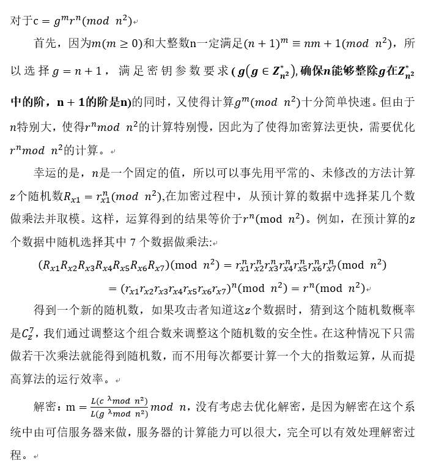

# Work
```
1. 优化Python库paillier中的加密部分：用预计算的方式，以额外存储为代价减少计算量，提高加密效率。
2. 用python实现服务器和客户端Demo，验证模型和算法的有效性。（socket、ssl）
3. 云边计算模型：去中心化的思想，减少中心服务器的负载，实现高可用。
4. 安全的联邦学习：对训练出来的特征值也加密，防止特征信息的泄露，进一步提高原数据的安全
```
# 同态加密
- Paillier的优化

- 为什么不用多密钥同态
```
如果使用多密钥同态，每个用户使用自己的公钥加密，即使密文由不同公钥生成，也能实现聚合。多密钥同态虽然不需要可信第三方，但是，解密的时候需要所有的参与方来共同参与解密，通信成本非常高，对于计算能力不强，又有可能使用流量的智能移动设备来讲，代价太大。
使用paillier加密，在对paillier加密优化后，已经减轻了移动端的计算压力，解密工作交给了可信服务器，在通信方面的代价、计算的速度方面都要比多同态要好。
```